<div align="center">

# Ritual Sovereign Agent

**Deploy a recurring, sovereign AI agent on Ritual testnet with one command. No API keys.**

<a href="https://x.com/Zun2025"></a>

</div>

---

<h2 align="center">⭐ What is this? ⭐</h2>

A *sovereign agent* is a smart contract that wakes itself on a schedule. On every wake it runs an AI agent inside a secure enclave (TEE), pays for that run from its own on-chain wallet, and keeps going until the money runs out. It lives entirely on-chain.

---

<h2 align="center">📋 Prerequisites 📋</h2>

You need three things. The script installs everything else for you (foundry, uv, and - on Linux/WSL - curl).

1. **git** - to download the code. Most systems already have it; if `git --version` fails, install it (see below).
2. A **wallet on Ritual testnet** with a little RITUAL in it. Create one in MetaMask or Rabby, then get free testnet RITUAL from the faucet: https://faucet.ritualfoundation.org
3. That wallet's **private key** (use a throwaway testnet wallet - never a real one). You paste it once, when the script asks.

**Installing git** (skip if `git --version` already works):

- **Windows:** install [Git for Windows](https://git-scm.com/download/win) - it also bundles Git Bash and curl - or run `winget install Git.Git`.
- **macOS:** `xcode-select --install` (or `brew install git`).
- **Linux / WSL:** `sudo apt install git` (Debian/Ubuntu), or your distro's package manager.

---

<h2 align="center">🏃 Quick Start 🏃</h2>

### Step 1 - Get the code

```bash
git clone https://github.com/zunmax/ritual-agent-deployment.git
cd ritual-agent-deployment
```

### Step 2 - Configure

```bash
cp .env.example .env
```

There is nothing you must edit - the defaults work. `PROMPT` is the task your agent runs on every wake, so change it to anything you like.

### Step 3 - Deploy

On Windows, using PowerShell 7 (`pwsh`):

```powershell
pwsh -ExecutionPolicy Bypass -File run.ps1
```

On Windows, using Windows PowerShell 5.1 (`powershell`, which is preinstalled on every Windows):

```powershell
powershell -ExecutionPolicy Bypass -File run.ps1
```

`-ExecutionPolicy Bypass` lets the script run without changing any system setting (Windows blocks unsigned scripts by default); it applies only to this one launch.

On Linux / macOS / Git Bash / WSL:

```bash
bash run.sh
```

---

<h2 align="center">🛠 Managing your agents 🛠</h2>

Each agent is its own contract at a fixed address (your wallet plus a salt). On Windows, use `pwsh -ExecutionPolicy Bypass -File run.ps1` in place of `bash run.sh` in the examples below.

```bash
bash run.sh                          # deploy your first agent using .env 
bash run.sh view                     # list all your agents
bash run.sh view 0xSomeWallet...     # list the agents of any wallet
bash run.sh topup 0xAgent... 2       # deposit 2 RITUAL into agent wallet
bash run.sh topup 0xAgent...         # deposit the .env DEPOSIT amount
```
---

<h2 align="center">🩺 Status & health checks 🩺</h2>

Before funding anything, check the agent's status on the explorer: **https://ritual-testnet-explorer.vercel.app/**

Read the status, then act on it:

- **Agent is dead** -> do **not** deposit. The deposit transaction still succeeds on-chain, but the RITUAL is stranded: the agent has no scheduled wake left (the Scheduler reverts with `CallNotFound()`), so the funds are never spent and cannot be recovered. A dead agent cannot be revived by funding it - deploy a fresh agent instead.

- **Agent is live but low on RITUAL** -> top it up **immediately** with `topup`. A live agent keeps itself going by scheduling its next wake on every wake, but only while it has the balance to pay for it. If it drains and misses a wake, the call chain breaks and funding can no longer restart it.

**Known limitation:** the `restart`, `start`, `withdraw`, and `stop` functions are not callable - an implementation bug in Ritual's proxy contract makes them revert. The Ritual team must upgrade the proxy contract before these work. Until then there is no way to restart a dead agent or withdraw stranded RITUAL.

---

<h2 align="center">⚙️ Configuration ⚙️</h2>

`.env` holds no secrets - only your public address and run settings.

| Variable | Purpose |
| --- | --- |
| `RPC_URL` | Ritual testnet RPC endpoint. |
| `CHAIN_ID` | `1979` (Ritual testnet). |
| `DEPOSIT` | RITUAL to lock into the agent's wallet on deploy. Use a plain number, where `1` means 1 RITUAL and decimals like `0.5` are fine. One wake costs about 0.5 to 1 RITUAL. `1` is the minimum a deploy accepts, and `5` gives about 5 wakes of headroom. |
| `CLI_TYPE` | Harness type. `6` = ZeroClaw. |
| `MODEL` | Model id routed through Ritual's gateway (no external key). Default `zai-org/GLM-4.7-FP8`. |
| `PROMPT` | The task the agent runs on each wake. |
| `SALT` | Any unique string - changes the agent address. Use a new one per agent. |
| `LOCK_BLOCKS` | Optional. Blocks a deposit stays locked. Defaults to `100000`. |
| `KEYSTORE_ACCOUNT` | Written automatically on first run - the name of your keystore. |
| `WALLET_ADDRESS` | Written automatically on first run - your public address. |

Your private key is never written to `.env`; it lives encrypted in `~/.foundry/keystores`. Still, use a **testnet burner** wallet - do not import one with real funds.

---

<h2 align="center">🌐 Network 🌐</h2>

| Network | Chain ID | RPC | Faucet |
| --- | --- | --- | --- |
| **Ritual testnet** | `1979` | `https://rpc.ritualfoundation.org` | https://faucet.ritualfoundation.org |

---

<h2 align="center">📜 Disclaimer & License 📜</h2>

This tool signs transactions with a key it stores in an encrypted keystore under `~/.foundry/keystores` - use a testnet burner wallet, never one with real funds. The deposit you lock funds the agent's scheduled runs and is spent over time - it is not recoverable on a whim. This is testnet software, provided as-is, without warranty, and has not been audited. Use at your own risk.

Released under the **MIT License**. Built by [Zun](https://x.com/Zun2025).
